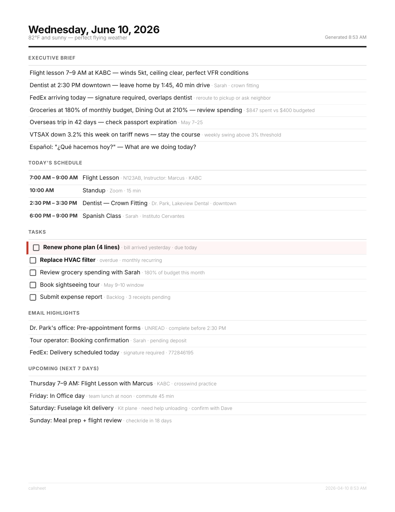

[](https://codecov.io/gh/gemivnet/callsheet)


# Callsheet

**Your household's daily brief — fetched, prioritized, and printed by AI.**

In the film industry, a *call sheet* is the single page that tells everyone on set where to be, what's happening, and what to prepare for. This is that, but for your home.

Think of it as a Presidential Daily Brief for home life. Callsheet pulls data from your calendar, tasks, email, weather, budget, and other sources — feeds it all to Claude — and Claude decides what actually matters today. The result is a single printed page on the counter every morning. Not everything that's happening. Just what you need to know.

It's opinionated by design. Claude acts as an analyst, not a formatter — connecting dots across sources ("your flight lesson is at 9 AM but the ceiling drops to 1200 by then"), filtering noise (routine emails, unremarkable weather), and surfacing what needs action now. Quiet days get short briefs. Busy days get dense ones.

Built for ADHD households, busy couples, and anyone who's tired of context-switching between twelve apps before coffee.

<p align="center">
  
</p>

---

## How it works

```
cron (6:30 AM)
  → callsheet
    → connectors fetch data (calendar, tasks, email, weather, ...)
    → Claude reads everything, decides what matters
    → outputs structured JSON brief
    → @react-pdf/renderer renders to PDF
    → CUPS sends to your printer
```

**Claude is the analyst.** It doesn't format your data into a template — it makes judgment calls. Flight lesson on the calendar + TAF showing ceiling dropping to 1200 at lesson time = *"Ceiling forecast MVFR at 9 AM — confirm with your CFI."* Billing email from Phone plan yesterday + no renewal task = *"Renew Phone plan today before auto-suspend."* Fourteen items building up in someone's inbox = *"Process inbox tonight?"* Unremarkable weather on a day with no outdoor plans? Not mentioned.

## What the brief looks like

A single-page PDF — every item earns its spot:

- **Executive Brief** — Claude's cross-referenced intelligence: conflicts, weather impacts, email signals, deadline countdowns, budget alerts, logistics
- **Today's schedule** — calendar events with locations and travel time context
- **Tasks** — prioritized by what's urgent *today*, not Todoist order. Checkboxes you mark with a pen
- **Email highlights** — only actionable emails, not a list of everything received
- **Upcoming** — things this week that need preparation, collapsed where repetitive

Sections adapt to the day. Quiet Tuesday? Half-page brief. Packed Thursday before a trip? Dense and focused. Claude doesn't manufacture importance to fill space.

**Memory across days:** After each brief, Claude extracts key insights and saves them. The next day's brief tracks deliveries, follows up on deadlines, and avoids repeating stale observations.

**Brief diff:** Yesterday's brief is summarized as context so Claude highlights what's new or changed.

## Quick start

> **First time?** The [Setup Guide](docs/SETUP_GUIDE.md) is a detailed walkthrough with connector-by-connector instructions, output analysis tips, cost breakdowns, and troubleshooting.

### Option A: Interactive setup script

An interactive script walks you through everything — dependencies, API keys, connectors, printer, and scheduling.

> **Important:** Always review shell scripts before running them. We are not responsible for any issues caused by running this script. Read through [`setup.sh`](setup.sh) first to understand what it will do on your system.

```bash
git clone https://github.com/gemivnet/callsheet.git
cd callsheet

# Review the script first!
less setup.sh

# Then run it
bash setup.sh
```

Flags: `--headless` (non-interactive), `--skip-deps` (skip system packages), `--skip-print` (skip printer setup). See `bash setup.sh --help`.

### Option B: Manual setup

#### 1. Clone and install

```bash
git clone https://github.com/gemivnet/callsheet.git
cd callsheet
npm install
```

No system dependencies needed — PDF rendering uses `@react-pdf/renderer` (pure JS, no Chromium, no WeasyPrint).

#### 2. Configure

```bash
cp config.example.yaml config.yaml
cp .env.example .env
```

Edit `.env` with your API keys. Edit `config.yaml` to enable connectors and add household context.

#### 3. Set up Google APIs (if using Calendar or Gmail)

1. Create a project in [Google Cloud Console](https://console.cloud.google.com)
2. Enable **Google Calendar API** (and **Gmail API** if using email)
3. Create **OAuth 2.0 Client ID** (Desktop application type)
4. Download credentials and save as `secrets/credentials.json`

```bash
npm run auth:gcal
npm run auth:gmail
```

#### 4. Test your connectors

```bash
# Test all enabled connectors
npm test

# Test specific ones
npx tsx src/cli.ts --test todoist weather

# See full raw data
npm run data
```

The test tool shows you exactly what data each connector returns, how many items, estimated token cost, and a preview of the data structure — without making a Claude API call.

#### 5. Generate a brief

```bash
# Preview (saves PDF, doesn't print)
npm run preview

# Full run (generates + prints)
npm run print
```

Or build once and run compiled:

```bash
npm run build
node dist/cli.js --preview
```

#### 6. Schedule with cron

```bash
crontab -e
```

```
30 6 * * * cd /path/to/callsheet && /usr/bin/node dist/cli.js >> output/cron.log 2>&1
```

## Connectors

Connectors are pluggable data sources. Enable them in `config.yaml`, test with `--test`.

| Connector | What it does | Auth |
|-----------|-------------|------|
| `google_calendar` | Today's events + 7-day lookahead | Google OAuth |
| `todoist` | Tasks, inbox, upcoming (multi-account) | API token |
| `gmail` | Scans recent emails for actionable signals | Google OAuth |
| `weather` | Today's forecast via NWS | None (free) |
| `aviation_weather` | METAR/TAF for nearby airports | None (free) |
| `home_assistant` | Smart home sensor states + anomalies | HA token |
| `market` | Stock/fund daily snapshot + news | None (free) |
| `actual_budget` | Recent transactions, spending, budget alerts | Server password |

### Writing your own

Create a file in `src/connectors/`, export a `create` factory function, and register it in `src/connectors/index.ts`. See [docs/CONNECTORS.md](docs/CONNECTORS.md).

```typescript
import type { Connector, ConnectorConfig, ConnectorResult } from "../types.js";

export function create(config: ConnectorConfig): Connector {
  return {
    name: "my_source",
    description: "My Source — one liner",

    async fetch(): Promise<ConnectorResult> {
      const data = await getMyData();
      return {
        source: "my_source",
        description: "Tell Claude what this data is and what to look for.",
        data: { items: data },
        priorityHint: "normal",
      };
    },
  };
}
```

## Customization

### Three things you tune

| File | What it does |
|------|-------------|
| `config.yaml` | Which connectors are on, accounts, API settings |
| `src/prompts/system.md` | Claude's instructions — sections, tone, what to flag |
| `config.yaml > context:` | Household info so Claude makes smarter connections |

### Household context

The `context:` block in your config gets injected into Claude's prompt:

```yaml
context:
  people: "Alex and Jordan"
  adhd: "Jordan has ADHD — keep it scannable, flag inbox buildup"
  work: "Alex is a nurse, 3x12hr shifts. Jordan is remote."
  hobbies: "Both learning pottery. Alex runs marathons."
  bills: "Phone plan bills monthly, needs manual renewal next day"
  travel: "Family trip to Japan, June 1-14. Flag packing under 7 days."
  deadlines: "Jordan's thesis due April 30. Bar exam July 2026."
```

### The prompt

`src/prompts/system.md` controls what Claude generates. Want a word-of-the-day? Add a section. Want Claude to ignore market data unless it drops 5%? Change the threshold.

### The PDF layout

`src/render.tsx` controls the visual design using React components and `@react-pdf/renderer`. Modify the `StyleSheet.create()` styles to change fonts, spacing, colors, or page size.

## Architecture

```
callsheet/
├── src/
│   ├── cli.ts                     # CLI entry point
│   ├── core.ts                    # Orchestrator: fetch → Claude → PDF → print
│   ├── render.tsx                 # React PDF components + styling
│   ├── test-connectors.ts        # Connector test runner
│   ├── types.ts                   # Shared TypeScript interfaces
│   ├── connectors/
│   │   ├── index.ts               # Registry + loader
│   │   ├── base.ts                # Type re-exports
│   │   ├── google-calendar.ts
│   │   ├── todoist.ts
│   │   ├── gmail.ts
│   │   ├── weather.ts
│   │   ├── aviation-weather.ts
│   │   ├── market.ts
│   │   ├── home-assistant.ts
│   │   └── actual-budget.ts
│   └── prompts/
│       └── system.md              # Claude's instructions (tune this!)
├── docs/
│   └── CONNECTORS.md              # How to write connectors
├── config.example.yaml
├── package.json
├── tsconfig.json
├── .env.example
├── .gitignore
└── README.md
```

## Cost

At ~2K input + ~1.5K output tokens per brief:

| Model | Per brief | Per month |
|-------|-----------|-----------|
| Sonnet | ~$0.02 | ~$0.60 |
| Opus | ~$0.15 | ~$4.50 |

## Why this exists

### Why print?

A physical page on the counter gets looked at. An app in a notification drawer doesn't. For ADHD, the brief is ambient, visible, and requires zero activation energy — it's just *there*.

### Why AI, not a template?

A template gives you a formatted list of your data — a dashboard. Claude gives you *"Your flight lesson is at 9 but the TAF shows ceiling dropping to 1200 by then — call your CFI."* The difference is judgment. A template shows you everything. An analyst shows you what matters. Callsheet is an analyst.

### Why connectors, not just APIs?

Every household is different. The connector pattern means you write a TypeScript file, export a factory, register it, and it works. But this isn't meant to be a catch-all — more connectors doesn't mean a better brief. Add sources that give Claude meaningful signal. Skip sources that add noise.

### Can I use this without a printer?

Yes. `--preview` saves the PDF. Email it, display it on a tablet, show it on a dashboard — whatever works.

## Contributing

PRs welcome — especially new connectors. See [docs/CONNECTORS.md](docs/CONNECTORS.md).

Some ideas: Slack, GitHub, Fitbit, Anki, Radarr/Sonarr, Notion, CalDAV, garbage/recycling schedules, Withings, Oura Ring, air quality.

## License

MIT
